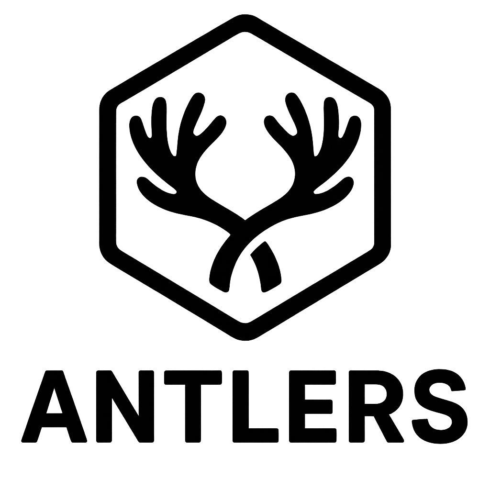

  <i>Calamoose Labs Presents</i>

  

<h1 align="center" style="color: gold;">
  <u>A N T L E R S</u>
   
   
</h1>

**Antlers** is a repository of different helper scripts, flakes and templates to make working easier.

---

## Features

- **Scripts**: Some text here.
- **Templates**: Keep in the flow.
- **Flakes**: Nix Flakes.

---

## Getting Started

### Flakes

1. ...

2. ...

3 ....

### Templates

1. ...

2. ...

### Scripts

1. ...

2. ...

3. ...

4. ...

## License

Internal App is open-source software licensed under the MIT License.

   
   
  © 2025 Calamoose Labs, Inc.&nbsp;

