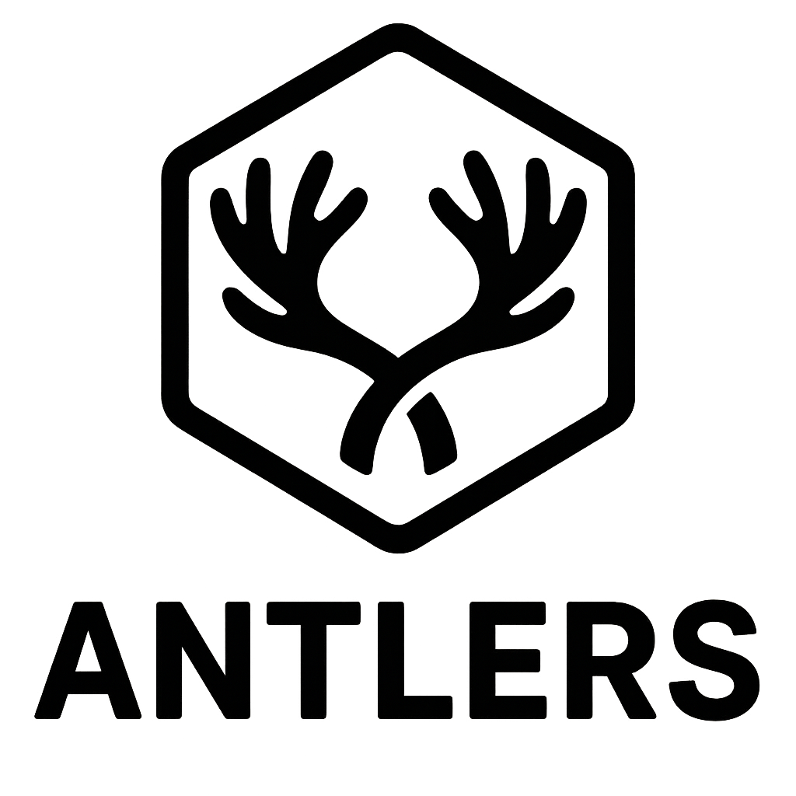

<p align="center" style="font-size: 1.5em;">
  <i>Calamoose Labs Presents</i>
</p>
<p align="center">
  
</p>
<h1 align="center" style="color: gold;">
  <u>A N T L E R S</u>
  <br />
  <br />
</h1>

**Antlers** is a single-flake grab-bag of reusable packages and templates for
NixOS. One repository, one branch (`master`), one root flake — you reach in and
pull out exactly the one package or template you need by name.

---

## How it is laid out

Everything is exposed by the **root `flake.nix`**, which aggregates:

- **`packages/`** (`flakes/`) — buildable packages, selected with `#<name>`.
- **`templates/`** — `nix flake init` templates, selected with `-t #<name>`.

> **Why one repo and not a branch per package?** With any `github:` reference,
> Nix downloads the **whole** repository tarball for that revision — `?dir=` and
> `#attr` only pick *which* flake and output to use *after* the download. Per-package
> branches therefore reduce nothing for the consumer and just create N branches to
> keep merged. A single root flake gives the same "grab one thing" experience with
> one lockfile and no cross-branch maintenance. (The only way to genuinely shrink a
> download is a separate repo per package.)

---

## Grab a single package

```sh
nix run   github:CalamooseLabs/antlers#zed-editor      # wrapped Zed editor
nix build github:CalamooseLabs/antlers#plex-desktop    # Plex w/ Hyprland+Stylix fixes
```

Pin to a tag or commit for reproducibility: `github:CalamooseLabs/antlers/<rev>#zed-editor`.

As a flake input:

```nix
inputs.antlers.url = "github:CalamooseLabs/antlers";
# inputs.antlers.packages.x86_64-linux.zed-editor          # ready-to-run derivation
# inputs.antlers.lib.x86_64-linux.mkZedWrapper { … }       # custom Zed settings
# or add inputs.antlers.overlays.default to nixpkgs.overlays
```

| Package        | Selector        | What it is                                                       |
| -------------- | --------------- | ---------------------------------------------------------------- |
| `zed-editor`   | `#zed-editor`   | Zed launched against a project-pinned config merged over the user's global Zed settings |
| `plex-desktop` | `#plex-desktop` | `plex-desktop` wrapped with the Hyprland/Stylix Qt + portal fixes |
| `lanserver`    | `#lanserver`    | a Deno LAN command server (ships `nixosModules.lanserver`) |
| `vibe`         | `#vibe`         | a Claude Code launcher with pinned model/effort/permissions + Remote Control (ships `nixosModules.vibe` → `programs.vibe`) — see [`flakes/vibe`](flakes/vibe/README.md) |
| `vibe-server`  | `#vibe-server`  | the Deno web session-manager behind `services.vibe-server` (ships `nixosModules.vibe-server`) — see [`flakes/vibe-server`](flakes/vibe-server/README.md) |

### You only pull what you name

Adding `antlers` as an input fetches its *source* (a few tiny `.nix`/`.tex`
files), but Nix is lazy — nothing under `packages` is evaluated or built unless
you actually reference it. Referencing `inputs.antlers.packages.x86_64-linux.zed-editor`
(or `lib.x86_64-linux.mkZedWrapper`) **never touches `plex-desktop`**: it isn't
built, downloaded, or even evaluated, and its `unfree`-ness can't trip you up
(no `allowUnfree` needed on your side). So "just zed-editor, not plex-desktop"
is the default — there is no separate import to do.

The one thing that adds *names* (still lazily, nothing builds) is the overlay:
`inputs.antlers.overlays.default` defines both `antlers-zed-editor` and
`plex-desktop-fixed` on `pkgs`. If you want strictly one, reference the package
directly instead of adding the overlay.

---

## NixOS modules

A few packages ship a companion NixOS module via `inputs.antlers.nixosModules.<name>`:

- **`vibe`** — `programs.vibe`, a Claude Code launcher pinned to `opus[1m]`
  (subscription-first). See [`flakes/vibe`](flakes/vibe/README.md).
- **`vibe-server`** — `services.vibe-server`, a browser session manager for `vibe`
  sessions. Import alongside `vibe` so sessions inherit its pins. See
  [`flakes/vibe-server`](flakes/vibe-server/README.md).
- **`lanserver`** — `services.lanserver`, a Deno LAN command server.

```nix
imports = [ inputs.antlers.nixosModules.vibe ];
programs.vibe.enable = true;   # `vibe` on PATH

# The web session manager is a separate module:
# imports = [ inputs.antlers.nixosModules.vibe-server inputs.antlers.nixosModules.vibe ];
# services.vibe-server.enable = true;
```

---

## Grab a single template

```sh
nix flake init      -t github:CalamooseLabs/antlers#nkc-report      # into current dir
nix flake new ./out -t github:CalamooseLabs/antlers#nkc-report      # into a new dir
nix flake show github:CalamooseLabs/antlers                         # list everything
```

`init` copies only that template's directory and won't overwrite existing files.
Afterwards run `direnv allow` (each template ships an `.envrc` with `use flake`).

| Template                | What it scaffolds                                   |
| ----------------------- | --------------------------------------------------- |
| `dev-shell`             | a minimal direnv + Nix dev shell                    |
| `zed-editor-shell`      | a dev shell with the wrapped Zed editor             |
| `spreadsheet-pdf`       | SC-IM spreadsheet → PDF (via `pandoc`)             |
| `tex-editor`            | a modular LaTeX document builder                    |
| `nkc-report`            | the NKC report document                             |
| `nkc-farmland-lease`    | the NKC farmland master lease document              |
| `nkc-lease-amendment`   | the NKC lease amendment document                    |
| `nkc-master-lease`      | the NKC commercial master lease + `create-lease` wizard |

The LaTeX/SC-IM templates build a PDF with `nix build` (output at `./result/`).
The document templates add sections with `nix flake new <path> -t .#article`
(also `section` / `subsection` / `subsubsection`).

**`nkc-master-lease`** is the most full-featured: the lease lives as a tree
of LaTeX nodes, and an interactive Python wizard (`create-lease`, on `PATH` in the
dev shell) fills the deal-specific variables, toggles which clauses to include, and
builds the PDF. Firm-wide defaults (lessor block, counsel, governing law) live in
its tracked `settings.json`; per-deal answers persist in a git-ignored `lease.json`.
See the template's own `CLAUDE.md` for the full workflow.

---

## Develop on antlers

```sh
direnv allow          # or: nix develop      (root dev shell ships claude-code)
nix fmt               # format with alejandra
nix flake check       # validate all outputs
nix flake show        # inspect the output tree
```

**Gotcha:** new `.nix` files must be `git add`-ed (no commit needed) or flake
evaluation can't see them. Packages are plain in-tree `package.nix` files consumed
via `callPackage` — no self-referencing `github:` inputs — so local edits take
effect immediately without pushing.

### Add a package

1. Create `flakes/<name>/package.nix` as a `{ <deps>, ... }: <derivation>` function.
2. Wire it into the root `flake.nix` (`packages.${system}.<name> = pkgs.callPackage ./flakes/<name>/package.nix {};`), plus an `apps`/`overlays` entry if runnable.
3. `git add`, then `nix flake check` / `nix build .#<name>`.

### Add a template

1. Create `templates/<name>/` (its `flake.nix`, `.envrc`, build files, `src/`).
2. Register it in `templates/templates.nix` with `{ path; description; welcomeText; }`.
3. If it consumes a shared antlers package, reference it via `github:CalamooseLabs/antlers` (a scaffolded-out repo can't use a relative path).
4. Test with `nix flake init -t .#<name>`.

**Conventions:** channel `nixos-unstable`, owner casing `NixOS` / `CalamooseLabs`,
format with `nix fmt` (alejandra) before committing.

## License

Antlers is open-source software licensed under the MIT License.

<p align="right">
  <br />
  <br />
  <span>© 2025 Calamoose Labs, Inc.</span>&nbsp;
</p>
